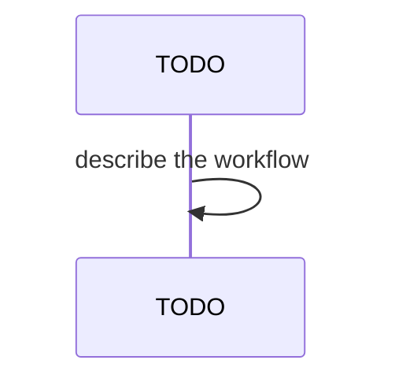

## Behavior

`runClusterUp(config, clusterConfig, opts)` executes in two phases:

**Phase 1 — Init**: Calls `runInitCluster()` (idempotent kind cluster creation, cert-manager, ingress).

**Phase 2 — Deploy**: Loads the app registry, calls `computeEffectiveDeploySet(registry, clusterConfig)` to determine which apps to deploy, then calls `runImageModeUp()` for each app in the effective set.

### computeEffectiveDeploySet Algorithm

```
effective = (apps where any tag in defaultTags ∪ overrideTags) ∪ extraApps − skipApps
```

Deduplication is by app name. `skipApps` takes precedence over all other inclusion criteria.

## Acceptance

- **FR-005-AC-1**: `runInitCluster()` is always called before any deploy, even if `--yes` is passed.
- **FR-005-AC-2**: Only apps matching a `defaultTags` tag are included in the base set.
- **FR-005-AC-3**: `extraApps` entries are unioned into the effective set after tag filtering.
- **FR-005-AC-4**: `skipApps` entries are removed from the effective set after union.
- **FR-005-AC-5**: An app appearing in both tag-filter and `extraApps` is deployed exactly once.
- **FR-005-AC-6**: The effective set is deterministic — same inputs always produce same ordered output.
- **FR-005-AC-7**: Output uses `introCommand`/`outroSuccess`/`outroError` from `@agent-ix/ix-ui-cli` (NFR-001).

## Workflow



