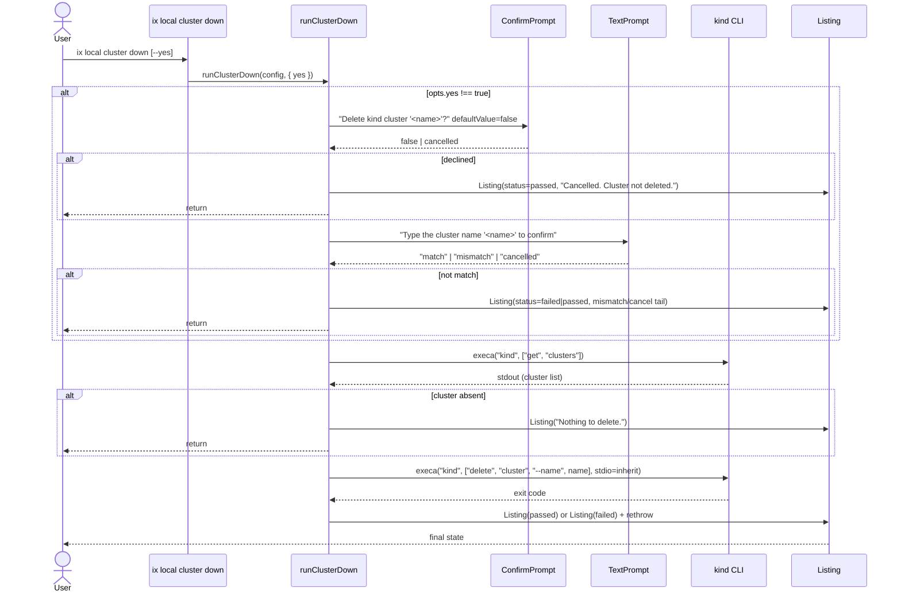

## Description

`runClusterDown(config, opts)` tears down the kind cluster behind two confirmation gates:

1. If `opts.yes` is false, render a `<ConfirmPrompt>` (default false) with a message naming the specific cluster (NFR-002-AC-1). If declined or cancelled, render a cancelled `<Listing>` and return.
2. Render a second `<TextPrompt>` requiring the user to retype the cluster name verbatim (case-sensitive). On mismatch, render a `failed` listing with a "name did not match" message and return non-zero.
3. Call `kind get clusters` and check whether the target cluster is listed.
4. If absent, render an info `<Listing>` and return.
5. Call `kind delete cluster --name <name>` with `stdio: "inherit"`.
6. On success: render a passed `<Listing>`. On failure: render a `failed` `<Listing>` and rethrow.

`opts.yes` bypasses both confirmation gates so scripts can run unattended.

## Acceptance Criteria

| ID | Criteria | Verification |
|----|----------|--------------|
| FR-006-AC-1 | Without `--yes`, a `<ConfirmPrompt>` is shown before any destructive action. | Test |
| FR-006-AC-2 | Prompt decline or cancel returns without calling `kind delete cluster`. | Test |
| FR-006-AC-3 | The command is idempotent — absent cluster returns with an informational message. | Test |
| FR-006-AC-4 | `kind delete cluster` is the only process spawned for destruction (no helm uninstall). | Test |
| FR-006-AC-5 | Failure of `kind delete cluster` propagates the error after rendering a `failed` listing. | Test |
| FR-006-AC-6 | After the first confirm passes, a second prompt requires the user to retype the cluster name; mismatch aborts before any destructive call. | Test |
| FR-006-AC-7 | `--yes` bypasses both confirmation gates. | Test |

- **FR-006-AC-1**: Without `--yes`, a `<ConfirmPrompt>` is shown before any destructive action.
- **FR-006-AC-2**: Prompt decline or cancel returns without calling `kind delete cluster`.
- **FR-006-AC-3**: The command is idempotent — absent cluster returns with an informational message.
- **FR-006-AC-4**: `kind delete cluster` is the only process spawned for destruction (no helm uninstall).
- **FR-006-AC-5**: Failure of `kind delete cluster` propagates the error after rendering a `failed` listing.
- **FR-006-AC-6**: After the first confirm passes, a second prompt requires the user to retype the cluster name; mismatch aborts before any destructive call.
- **FR-006-AC-7**: `--yes` bypasses both confirmation gates.

## Workflow

## Dependencies

- **implements**: ix-cli/spec/usecase/US-004
- **implements**: ix-cli/spec/functional/local/FR-004
- **requires**: ix-cli/spec/non-functional/local/NFR-002
