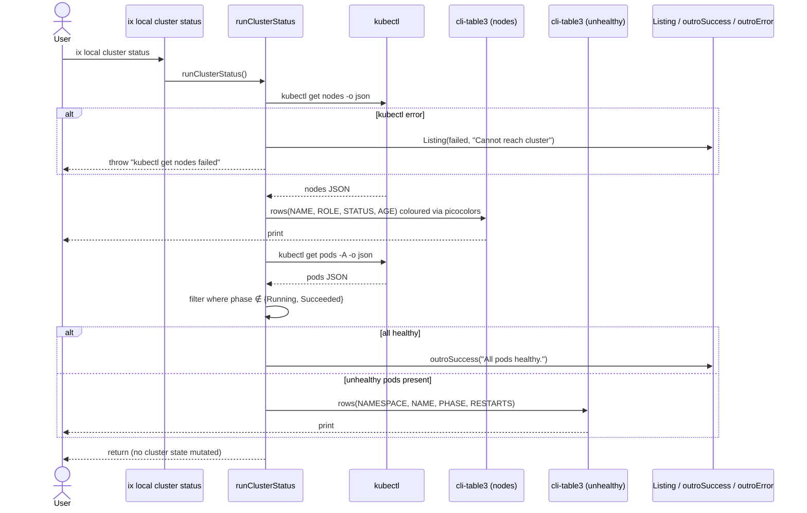

## Description

`runClusterStatus()` renders cluster health using two kubectl queries:

**Node table** — `kubectl get nodes -o json` → cli-table3 table with columns: NAME, ROLE, STATUS, AGE. ROLE is `control-plane` (has `NoSchedule` taint) or `worker`. STATUS is `Ready` or `NotReady` (colorised via picocolors). AGE is computed from `metadata.creationTimestamp`.

**Pod table** (conditional) — `kubectl get pods -A -o json`. Pods with phase `Running` or `Succeeded` are healthy. If unhealthy pods exist, a second table is rendered: NAMESPACE, NAME, PHASE (colorised), RESTARTS. If all pods are healthy, `outroSuccess("All pods healthy.")` is shown and no pod table is rendered.

## Acceptance Criteria

| ID | Criteria | Verification |
|----|----------|--------------|
| FR-007-AC-1 | Node table is always rendered with NAME, ROLE, STATUS, AGE columns. | Test |
| FR-007-AC-2 | STATUS column shows `Ready` for nodes with Ready condition True. | Test |
| FR-007-AC-3 | ROLE column shows `control-plane` for nodes with a `NoSchedule` taint. | Test |
| FR-007-AC-4 | When all pods are in Running or Succeeded phase, only `outroSuccess("All pods healthy.")` is shown. | Test |
| FR-007-AC-5 | Unhealthy pods are listed in a second table with NAMESPACE, NAME, PHASE, RESTARTS columns. | Test |
| FR-007-AC-6 | Failure of `kubectl get nodes` calls `outroError` and throws a descriptive error. | Test |
| FR-007-AC-7 | No cluster state is modified. | Test |

- **FR-007-AC-1**: Node table is always rendered with NAME, ROLE, STATUS, AGE columns.
- **FR-007-AC-2**: STATUS column shows `Ready` for nodes with Ready condition True.
- **FR-007-AC-3**: ROLE column shows `control-plane` for nodes with a `NoSchedule` taint.
- **FR-007-AC-4**: When all pods are in Running or Succeeded phase, only `outroSuccess("All pods healthy.")` is shown.
- **FR-007-AC-5**: Unhealthy pods are listed in a second table with NAMESPACE, NAME, PHASE, RESTARTS columns.
- **FR-007-AC-6**: Failure of `kubectl get nodes` calls `outroError` and throws a descriptive error.
- **FR-007-AC-7**: No cluster state is modified.

## Workflow

## Dependencies

- **implements**: ix-cli/spec/usecase/US-005
- **implements**: ix-cli/spec/functional/local/FR-004
