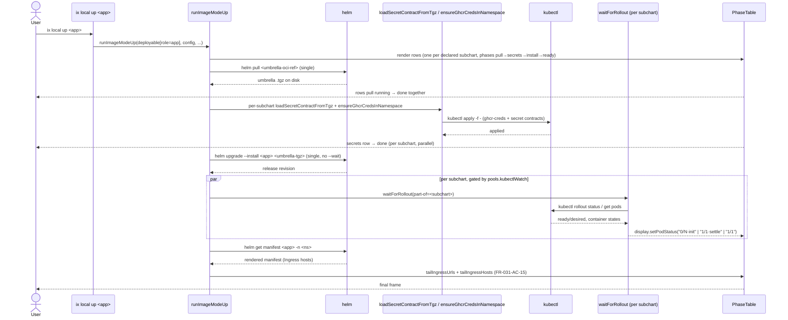

## Description

`runImageModeUp` collapses an app-role deployable into a **single Helm
release** per umbrella chart, instead of one release per declared subchart.

The umbrella's `Chart.yaml` deps still drive what gets deployed and, by
extension, which rows the `PhaseTable` shows. Helm itself topologically
installs the subcharts inside one release; ix-cli runs per-subchart
`kubectl rollout status` watchers in parallel during the `ready` phase to
stream live status into each row.

### Phase mapping in umbrella mode

- **pull** — single `helm pull` of the umbrella OCI ref. All rows transition
  `running → done` together when the tarball lands.
- **secrets** — per-subchart, parallel (unchanged from [FR-013](../elements/FR-013-elements-new.md)).
- **install** — single `helm upgrade --install` against the pulled umbrella
  tarball. Rows remain visible but inactive unless their own Helm hook or
  Kubernetes workload status is active.
  No `--wait` / `--atomic` — opaque waits would defeat the per-subchart
  watcher visibility.
- **ready** — per-subchart, parallel. Each row's watcher polls
  `kubectl rollout status` filtered by `app.kubernetes.io/part-of=<subchart>`.

### Settling indicator

`getDeploymentStatus` (in `rollout.ts`) appends a `·` suffix to the
`ready/desired` count when pods are at `ready === desired` but the
Deployment has not finished reconciling — specifically when
`status.observedGeneration < metadata.generation` or
`status.availableReplicas < .spec.replicas` or
`status.updatedReplicas < .spec.replicas`. StatefulSets also remain
settling while `currentRevision !== updateRevision`. This explains the
"1/1 but clock keeps ticking" case to the operator: pods can be ready while
the controller is still converging the current revision.

### Pod ready label

`waitForRollout` enriches the status string passed to `onStatus` with a
human-readable label when `readyReplicas === 0`. The label is determined by
`getPodReadyLabel` which polls pod container states:

| Label   | Condition                                                         |
| ------- | ----------------------------------------------------------------- |
| `sched` | No pods scheduled yet                                             |
| `init`  | Any init container not ready, or waiting reason `PodInitializing` |
| `start` | Waiting reason `ContainerCreating`                                |

The enriched format is `"0/N·label"` (e.g. `"0/1·init"`). The `PhaseTable`
renders the label in dim text alongside a yellow `0` — never red — because
`0/N` during normal startup is transient, not a failure.

```
 ⊚  [ ix local up · auth ]
 |
 • Loading Helm charts from ghcr.io
 |
 • Starting App: auth
 └──┐
    ⠦ auth-service        0/1·init       2.1s
    ⠦ identity            0/1·start      2.4s
    ⠦ permission-service  1/3            3.0s
    • vault               1/1            4.2s
    • elapsed 4.2s · 1/4 ready
```

## Acceptance Criteria

| ID | Criteria | Verification |
|----|----------|--------------|
| FR-031-AC-1 | For `deployable.role === "app"`, exactly one `helm upgrade --install <app-name> <umbrella-tgz>` runs per `ix up` invocation, regardless of how many subcharts the umbrella declares. | Test |
| FR-031-AC-2 | Exactly one `helm pull` runs per umbrella per invocation; `pools.dockerPull` is no longer used in the app branch. | Test |
| FR-031-AC-3 | Each subchart's row in the `PhaseTable` still shows `secrets / pull / install / ready` columns and transitions through them. | Test |
| FR-031-AC-4 | Per-subchart `waitForRollout` watchers run in parallel during the `ready` phase, gated by `pools.kubectlWatch`, and stream pod-ready counts to the row via `display.setPodStatus`. | Test |
| FR-031-AC-5 | When `helm pull` of the umbrella fails, all subchart rows show `pull failed` with the umbrella error message; the install short-circuits. | Test |
| FR-031-AC-6 | When the umbrella `helm upgrade --install` fails without a child-row hook match, the final `PhaseTable` frame is marked failed and shows the umbrella error at the bottom; rollout watchers are not started. | Test |
| FR-031-AC-7 | When a subchart's rollout fails, only that row shows `ready failed`; sibling watchers continue to completion ([FR-021-AC-5](../core/FR-021-ix-login.md)). | Test |
| FR-031-AC-8 | `getDeploymentStatus` returns a `ready/desired·settle` string when at least one workload reports `ready === desired` AND (`observedGeneration < generation` OR `availableReplicas < replicas` OR `updatedReplicas < replicas` OR StatefulSet `currentRevision != updateRevision`). | Test |
| FR-031-AC-9 | A `helm history <app-name>` command shows a single unified release history for the whole umbrella. | Test |
| FR-031-AC-10 | A `helm list` shows exactly one row per app instead of one per subchart. | Test |
| FR-031-AC-11 | `runDown` (`ix local halt <app>`) for `role=app` uninstalls the umbrella release first, then any leftover per-subchart releases (transitional cleanup). Both pushed via a deduping `pushRelease` helper so the same release isn't queued twice. | Test |
| FR-031-AC-12 | Per-subchart uninstall during halt uses `--ignore-not-found` so missing legacy releases are a no-op, not an error — supports users mid-migration with mixed release state. | Test |
| FR-031-AC-13 | When `readyReplicas === 0`, `waitForRollout` passes an enriched status string `"0/N·label"` to `onStatus` where `label` is one of `sched`, `init`, or `start` depending on pod container state. When `readyReplicas > 0` or `getPodReadyLabel` returns `null`, the bare `"ready/total"` string is passed unchanged. | Test |
| FR-031-AC-14 | A row with `"1/1·settle"` or any other state-labeled ready count remains active until the state label disappears and the row receives plain `"1/1"`. | Test |
| FR-031-AC-15 | On successful umbrella app install, ix-cli reads final ingress URLs from `helm get manifest <app-name> -n <namespace>` and passes every rendered Ingress host to the PhaseTable ingress section as a flat list via `tailIngressUrls`, alongside `tailIngressHosts = config.hosts` for per-host grouping. TLS-covered hosts render with `https://`; non-TLS hosts render with `http://`. | Test |
| FR-031-AC-16 | When the rendered umbrella manifest contains URLs spanning multiple configured ingress hostnames, each URL is rendered under its `◎ Ingress · <host>` block (PhaseTable grouping per [FR-004-AC-9](./FR-004-cluster-subcommand-group.md)). Within each group, URLs preserve chart-rendered order; groups are rendered in the order their first URL appears in the rendered manifest. Example with `config.hosts = ["dev.ix", "luna.ix"]`: `https://auth.dev.ix` under `◎ Ingress · dev.ix`, then `https://auth.luna.ix` under `◎ Ingress · luna.ix`. | Test |
| FR-031-AC-17 | If the rendered manifest contains no Ingress hosts, ix-cli SHALL NOT synthesize a fallback URL from `<release>.<domain>`. | Test |

- **FR-031-AC-1**: For `deployable.role === "app"`, exactly one
  `helm upgrade --install <app-name> <umbrella-tgz>` runs per `ix up`
  invocation, regardless of how many subcharts the umbrella declares.
- **FR-031-AC-2**: Exactly one `helm pull` runs per umbrella per
  invocation; `pools.dockerPull` is no longer used in the app branch.
- **FR-031-AC-3**: Each subchart's row in the `PhaseTable` still shows
  `secrets / pull / install / ready` columns and transitions through them.
- **FR-031-AC-4**: Per-subchart `waitForRollout` watchers run in parallel
  during the `ready` phase, gated by `pools.kubectlWatch`, and stream
  pod-ready counts to the row via `display.setPodStatus`.
- **FR-031-AC-5**: When `helm pull` of the umbrella fails, all subchart
  rows show `pull failed` with the umbrella error message; the install
  short-circuits.
- **FR-031-AC-6**: When the umbrella `helm upgrade --install` fails without
  a child-row hook match, the final `PhaseTable` frame is marked failed and
  shows the umbrella error at the bottom; rollout watchers are not started.
- **FR-031-AC-7**: When a subchart's rollout fails, only that row shows
  `ready failed`; sibling watchers continue to completion ([FR-021-AC-5](../core/FR-021-ix-login.md)).
- **FR-031-AC-8**: `getDeploymentStatus` returns a `ready/desired·settle`
  string when at least one workload reports `ready === desired` AND
  (`observedGeneration < generation` OR `availableReplicas < replicas` OR
  `updatedReplicas < replicas` OR StatefulSet `currentRevision !=
updateRevision`).
- **FR-031-AC-9**: A `helm history <app-name>` command shows a single
  unified release history for the whole umbrella.
- **FR-031-AC-10**: A `helm list` shows exactly one row per app instead of
  one per subchart.
- **FR-031-AC-11**: `runDown` (`ix local halt <app>`) for `role=app`
  uninstalls the umbrella release first, then any leftover per-subchart
  releases (transitional cleanup). Both pushed via a deduping `pushRelease`
  helper so the same release isn't queued twice.
- **FR-031-AC-12**: Per-subchart uninstall during halt uses
  `--ignore-not-found` so missing legacy releases are a no-op, not an
  error — supports users mid-migration with mixed release state.
- **FR-031-AC-13**: When `readyReplicas === 0`, `waitForRollout` passes an
  enriched status string `"0/N·label"` to `onStatus` where `label` is one
  of `sched`, `init`, or `start` depending on pod container state. When
  `readyReplicas > 0` or `getPodReadyLabel` returns `null`, the bare
  `"ready/total"` string is passed unchanged.
- **FR-031-AC-14**: A row with `"1/1·settle"` or any other state-labeled
  ready count remains active until the state label disappears and the row
  receives plain `"1/1"`.
- **FR-031-AC-15**: On successful umbrella app install, ix-cli reads final
  ingress URLs from `helm get manifest <app-name> -n <namespace>` and passes
  every rendered Ingress host to the PhaseTable ingress section as a flat
  list via `tailIngressUrls`, alongside `tailIngressHosts = config.hosts`
  for per-host grouping. TLS-covered hosts render with `https://`; non-TLS
  hosts render with `http://`.
- **FR-031-AC-16**: When the rendered umbrella manifest contains URLs
  spanning multiple configured ingress hostnames, each URL is rendered
  under its `◎ Ingress · <host>` block (PhaseTable grouping per
  [FR-004-AC-9](./FR-004-cluster-subcommand-group.md)). Within each group, URLs preserve chart-rendered order;
  groups are rendered in the order their first URL appears in the
  rendered manifest. Example with `config.hosts = ["dev.ix", "luna.ix"]`:
  `https://auth.dev.ix` under `◎ Ingress · dev.ix`, then
  `https://auth.luna.ix` under `◎ Ingress · luna.ix`.
- **FR-031-AC-17**: If the rendered manifest contains no Ingress hosts,
  ix-cli SHALL NOT synthesize a fallback URL from `<release>.<domain>`.

## Workflow



## Dependencies

- **extends**: ix-cli/spec/functional/local/[FR-008](./FR-008-ix-core-tag-convention.md)
- **extends**: ix-cli/spec/functional/local/[FR-013](../elements/FR-013-elements-new.md)
