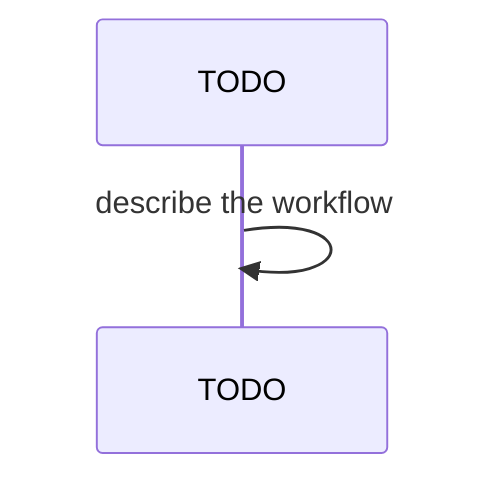

## Behavior

Image-mode installs (`ix local up <app>` without `--from-source`) reference
container images on ghcr.io. The kubelet pulls those images, which requires
a `kubernetes.io/dockerconfigjson` Secret named `ghcr-creds` in the install
namespace. Cluster bootstrap (`make secret-ghcr` in `local/`) creates this
secret only in `default` — every other namespace would otherwise need
manual provisioning.

`runImageModeUp` resolves the GHCR token via `resolveGhcrToken` (same chain
that authenticates `helm registry login`) and then calls
`ensureGhcrCredsInNamespace(namespace, token)` for every distinct install
namespace, **before** any helm install runs. The secret is built as a
`kubernetes.io/dockerconfigjson` manifest and applied via
`kubectl apply -f -` (idempotent — re-runs no-op).

This makes `ix up` "just work" against fresh kind clusters and new
namespaces: users don't have to remember to provision ghcr-creds per
namespace, and image pulls succeed regardless of whether the kind node
has cached layers from prior source-mode deploys.

## Acceptance

- **FR-032-AC-1**: `local-secrets.ts` exports `ensureGhcrCredsInNamespace`
  with signature `(namespace: string, token: string, username?: string) =>
  Promise<void>`.
- **FR-032-AC-2**: The function applies a `Secret` of type
  `kubernetes.io/dockerconfigjson` named `ghcr-creds`, with a
  `.dockerconfigjson` data field encoding `auths: { "ghcr.io": ... }`.
- **FR-032-AC-3**: `runImageModeUp` calls `ensureGhcrCredsInNamespace`
  exactly once per distinct install namespace, **after** GHCR token
  resolution and **before** helm install (covers both single-service and
  umbrella branches).
- **FR-032-AC-4**: The username defaults to `"_token"` (matching the
  `helm registry login -u "_token"` convention used elsewhere).
- **FR-032-AC-5**: Repeated invocations are no-ops — `kubectl apply` keeps
  the secret in sync without churning resourceVersion when content hasn't
  changed.
- **FR-032-AC-6**: Source mode (`up-source.ts`) is unaffected — that path
  uses `make build` + `make kind-load` per subchart, which loads images
  directly into the kind node and bypasses ghcr.io entirely.

## Workflow

