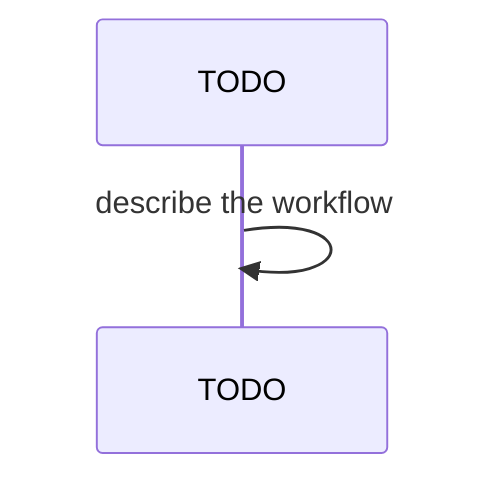

## Behavior

`ix local refresh` snapshots the existing registry cache before forcing a
re-discovery, then renders one body row per chart whose version changed or
that newly appeared. Rows use the standard `Listing.item()` body glyph
(`GLYPH_DONE`) so the dot matches `PhaseTable` and other listing views.

The row format is fixed:

- Changed chart: `<role>:<displayName> <oldVersion> -> <newVersion>`
- New chart:     `<role>:<displayName> (new) <newVersion>`

`displayName` is the chart's `title` annotation when set and non-empty,
otherwise the chart `name`. `role` is the existing `DeployableRole`
("app" | "service") on the `Deployable` shape.

The diff is computed by chart `name`. If the prior cache is absent, malformed,
or recorded against a different `org`, every entry in the fresh registry is
treated as new.

## Acceptance

- **FR-034-AC-1**: Per-chart rows are emitted via `Listing.item(...)`, not
  `note(...)` or `raw(...)`.
- **FR-034-AC-2**: Row text matches the format above exactly, including the
  ` -> ` separator and the literal `(new)` marker.
- **FR-034-AC-3**: `runRefresh` reads the cache snapshot before calling
  `loadRegistry({ refresh: true })`. The snapshot is the source of "old"
  versions for the diff.
- **FR-034-AC-4**: When the prior cache is missing or its `org` field does
  not match the configured org, the diff treats every fresh entry as new.
- **FR-034-AC-5**: When zero rows are produced, no `item()` calls are made;
  the command emits only the closing `success(...)` line.
- **FR-034-AC-6**: Registry-discovery errors continue to propagate — the
  command logs `error(...)` and rethrows, unchanged from prior behavior.

## Workflow

