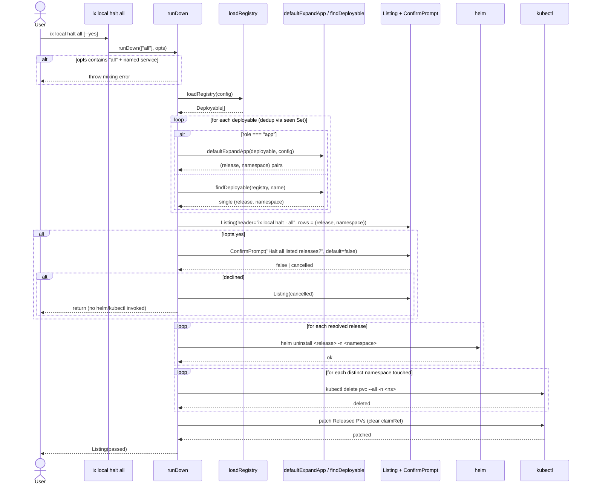

## Description

`runDown(servicesArgs, opts)` (in `packages/local/src/index.tsx`) currently rejects `"all"` in image mode. This FR replaces that rejection with full image-mode support:

1. If `servicesArgs` contains both `"all"` and a named service, throw the existing mixing error from `executeLocals` (line 89).
2. If `servicesArgs.includes("all")` and `!opts.fromSource`:
   - Load the registry via `loadRegistry(config)`.
   - For every deployable in the registry, resolve its `(release, namespace)` pair using the same expansion logic as named services: `findDeployable` + `defaultExpandApp` for `role: "app"`, single release otherwise (mirror existing lines 268–287).
   - Deduplicate via the existing `seen` Set.
3. Render a `<Listing>` of the resolved `(release, namespace)` pairs under header `ix local halt · all`.
4. If `opts.yes` is false, render `<ConfirmPrompt message="Halt all listed releases?" defaultValue={false}>`. If declined, render a cancelled listing and return without uninstalling.
5. On confirm (or with `--yes`), proceed with the existing destructive block (lines 293–331): `helm uninstall` per release, `kubectl delete pvc --all -n <ns>` per touched namespace, patch `Released` PVs to remove `claimRef`.

The bare `catch {}` at `apps/ix/src/commands/local/halt.ts:28` is replaced with an error-printing variant so failures surface to the user.

## Acceptance Criteria

| ID | Criteria | Verification |
|----|----------|--------------|
| FR-035-AC-1 | `ix local halt all` (no `--from-source`, no `--yes`) loads the registry and resolves every deployable to its `(release, namespace)` pair via the same expansion path used by named-service halt. | Test |
| FR-035-AC-2 | Before any destructive action, the command renders a `<Listing>` of every resolved release and namespace. | Test |
| FR-035-AC-3 | Without `--yes`, a `<ConfirmPrompt>` (default false) is shown; declining returns without invoking helm or kubectl. | Test |
| FR-035-AC-4 | `--yes` / `-y` bypasses the prompt and proceeds directly. | Test |
| FR-035-AC-5 | Named-service halt (`ix local halt <name>`) is unchanged — no listing, no prompt. | Test |
| FR-035-AC-6 | Mixing `"all"` with named services throws the existing mixing error. | Test |
| FR-035-AC-7 | After a successful image-mode `halt all`, no Helm releases remain in any namespace owned by ix-cli, all PVCs in those namespaces are deleted, and any `Released` PVs have had their `claimRef` cleared. | Test |
| FR-035-AC-8 | `apps/ix/src/commands/local/halt.ts` prints the error message before exiting non-zero on `runDown` failure (no bare `catch {}`). | Test |

- **FR-035-AC-1**: `ix local halt all` (no `--from-source`, no `--yes`) loads the registry and resolves every deployable to its `(release, namespace)` pair via the same expansion path used by named-service halt.
- **FR-035-AC-2**: Before any destructive action, the command renders a `<Listing>` of every resolved release and namespace.
- **FR-035-AC-3**: Without `--yes`, a `<ConfirmPrompt>` (default false) is shown; declining returns without invoking helm or kubectl.
- **FR-035-AC-4**: `--yes` / `-y` bypasses the prompt and proceeds directly.
- **FR-035-AC-5**: Named-service halt (`ix local halt <name>`) is unchanged — no listing, no prompt.
- **FR-035-AC-6**: Mixing `"all"` with named services throws the existing mixing error.
- **FR-035-AC-7**: After a successful image-mode `halt all`, no Helm releases remain in any namespace owned by ix-cli, all PVCs in those namespaces are deleted, and any `Released` PVs have had their `claimRef` cleared.
- **FR-035-AC-8**: `apps/ix/src/commands/local/halt.ts` prints the error message before exiting non-zero on `runDown` failure (no bare `catch {}`).

## Workflow

## Dependencies

- **implements**: ix-cli/spec/usecase/US-008
- **requires**: ix-cli/spec/functional/local/FR-031
- **extends**: ix-cli/spec/functional/local/FR-006
