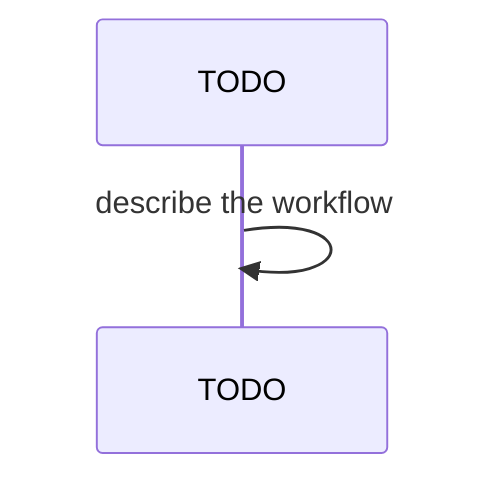

## Behavior

Two new commands extend the `ix local cluster` subcommand group (FR-004): `stop` and `start`. Implementations live in `packages/local/src/commands/cluster-stop.tsx` and `cluster-start.tsx`, mirroring the structure of `cluster-down.tsx` (deps seam for execa override, `<Listing>` for final state).

### `runClusterStop(config, opts, deps)`

1. Resolve the kind cluster name from `config.clusterName`.
2. Discover node containers: `kind get nodes --name <name>`. If no cluster exists, render `failed` listing with a message pointing to `ix local init` and return non-zero.
3. For each node container, run `docker stop <container>`. If the container is already stopped, capture the docker exit code as success (idempotent).
4. Render a `<Listing>` of `(node, state)` rows.

### `runClusterStart(config, opts, deps)`

1. Resolve the kind cluster name and discover its node containers (same as stop). Absent cluster → fail.
2. For each node container, run `docker start <container>`. Already-running containers are reported as `running` (idempotent).
3. Wait for the API server to respond by polling `kubectl get ns` (timeout 60s, 2s interval). Failure to become reachable within the timeout renders a warn listing but does not error out (the docker containers are running; user can investigate).
4. Render a `<Listing>` of `(node, state)` rows.

## Acceptance

- **FR-036-AC-1**: `ix local cluster stop` runs `docker stop` on every node container of the configured kind cluster.
- **FR-036-AC-2**: `ix local cluster start` runs `docker start` on every node container, then waits for the API server before returning.
- **FR-036-AC-3**: Both commands are idempotent: already-stopped containers on stop and already-running containers on start are reported but do not error.
- **FR-036-AC-4**: If no kind cluster exists, both commands render `failed` and return non-zero — they never auto-create the cluster.
- **FR-036-AC-5**: Both commands render a `<Listing>` reporting each node's resulting state.
- **FR-036-AC-6**: Stop → start round trip preserves PVC data and Helm release state (verified by integration test re-reading a known PVC after start).
- **FR-036-AC-7**: API-server reachability timeout on start renders a `warn` (not `failed`) listing, since the containers are running and the issue may be transient.

## Workflow

