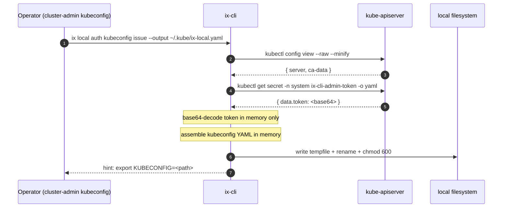

# [FR-044] `ix local auth kubeconfig issue` — Emit operator-scoped kubeconfig

## Description

`ix local auth kubeconfig issue` emits an operator-scoped kubeconfig backed
by the `system:serviceaccount:system:ix-cli-admin` ServiceAccount provisioned
by identity [FR-034](ix://agent-ix/identity/FR-034). The emitted kubeconfig carries the long-lived SA token
stored in `Secret system/ix-cli-admin-token` and is the canonical artifact an
operator switches to after `ix local init` finishes.

This command is **Phase 3** of the Operator Privilege Lifecycle defined in
auth/[FR-008](./FR-008-ix-core-tag-convention.md). After running it and exporting `KUBECONFIG` to the emitted file,
the operator is no longer using a cluster-admin kubeconfig for routine
`ix local auth *` operations: the runtime RBAC boundary collapses to exactly
what identity [FR-034](ix://agent-ix/identity/FR-034) grants (pods/exec on `auth/identity*`), and every other
cluster-admin verb (read Secrets in `auth`, exec arbitrary pods, delete
namespaces, get nodes) becomes a 403.

This command MUST be reachable using only a cluster-admin kubeconfig — the
operator-scoped kubeconfig it emits does NOT have `get` on the SA Secret, so
it cannot mint additional copies of itself. Re-issue always requires
cluster-admin (matches the plan recommendation for revocation tractability).

## Synopsis

```
ix local auth kubeconfig issue --output <path> [--context-name <name>] [--force]
```

## Flags

| Flag | Required | Default | Description |
|---|---|---|---|
| `--output <path>` | yes | — | Filesystem path where the new kubeconfig is written. Parent directory MUST exist. |
| `--context-name <name>` | no | `ix-local` | Value written as both the `contexts[0].name` and the `current-context` of the emitted kubeconfig. |
| `--force` | no | `false` | Overwrite the file at `--output` if it already exists. Without `--force`, an existing file at `--output` is a hard error. |

## Behavior

1. Read the active kubeconfig's cluster `server:` URL and CA data via
   `kubectl config view --raw --minify -o jsonpath='{.clusters[0].cluster}'`.
   The cluster section of the emitted kubeconfig is a verbatim copy of this
   block (`server`, `certificate-authority-data`, and any
   `insecure-skip-tls-verify` flag).
2. Read `Secret system/ix-cli-admin-token` via
   `kubectl get secret -n system ix-cli-admin-token -o yaml`. The caller MUST
   have `get` on this Secret — typically the cluster-admin kubeconfig
   present during initial bootstrap. A 403 here SHALL surface as
   `secret_forbidden` (see Errors).
3. Extract `.data.token` from the Secret and base64-decode the value
   in-memory. The decoded token SHALL NOT be assigned to a shell variable,
   passed as a process argument, or written to any file other than the
   `--output` kubeconfig.
4. Assemble a fresh kubeconfig YAML document with:
   - `apiVersion: v1`, `kind: Config`
   - one entry under `clusters` named after the source cluster (preserving
     the source's name where available; defaulting to `ix-local`)
   - one entry under `users` named `ix-cli-admin` with the decoded `token`
   - one entry under `contexts` named per `--context-name` (default `ix-local`)
     binding the cluster and user
   - `current-context:` set to the same value as the context name
5. Write the assembled document to `--output` and immediately `chmod 600`.
   The write SHALL be atomic (temp file in the same directory + rename) so
   a crash mid-write never leaves a partial kubeconfig on disk.

After step 5, the command prints a single one-line hint to stdout:

```
Wrote operator-scoped kubeconfig to <path>. Switch with: export KUBECONFIG=<path>
```

The token value SHALL NOT appear in any output stream, log file, telemetry
event, or audit record produced by ix-cli. The path SHALL NOT be printed
more than once.

## Errors

| Code | Trigger | Surface |
|---|---|---|
| `secret_not_found` | `kubectl get secret -n system ix-cli-admin-token` returns `NotFound` | "ix-cli admin ServiceAccount token Secret is missing. The identity Helm chart predates [FR-034](./FR-034-refresh-changed-output.md), or `ix local up` is incomplete. Run `ix local up` and retry." |
| `secret_forbidden` | `kubectl get` returns 403 on the Secret | "Caller cannot read `system/ix-cli-admin-token`. Re-run from a kubeconfig with `get` on that Secret (typically cluster-admin during bootstrap)." |
| `output_exists` | `--output` path exists, `--force` not set | "Refusing to overwrite existing file `<path>`. Pass `--force` to overwrite, or remove the file." |
| `kubectl_unavailable` | `kubectl` binary not on PATH or fails to execute | Standard ix-cli `kubectl_unavailable` envelope (matches existing `auth-identity.ts` helper). |
| `cluster_unreadable` | `kubectl config view` returns no cluster, or the active context is unset | "Could not read the active kubeconfig's cluster block. Ensure `KUBECONFIG` points at a working cluster-admin kubeconfig." |

All error envelopes follow the existing `runIxCommand` JSON contract; the
command exits non-zero and writes nothing to `--output` on any error.

## Constraints

- **FR-044-CON-1**: The command SHALL NOT make any HTTP, HTTPS,
  WebSocket, gRPC, or other networked request to identity, auth-service,
  permission-service, or any other ix service. The only outbound calls
  permitted are to the K8s API server, via `kubectl get`,
  `kubectl config view`, and equivalent read-only verbs.
- **FR-044-CON-2**: The output file SHALL have permissions `0600`
  immediately after write. Static analysis SHALL verify the `chmod 600`
  call follows the rename step.
- **FR-044-CON-3**: The decoded SA token SHALL NOT appear in stdout,
  stderr, ix-cli log files, telemetry events, audit records, OS-level
  process arguments (`argv`), or environment variables. The token transits
  process memory only between the base64 decode and the YAML serialize +
  write.
- **FR-044-CON-4**: The command SHALL fail closed if `Secret
  system/ix-cli-admin-token` is missing, empty, or contains a `.data.token`
  field that does not base64-decode. Emitting a kubeconfig with a placeholder,
  empty, or syntactically-invalid token is forbidden.
- **FR-044-CON-5**: The file write SHALL be atomic: temp file in the same
  directory as `--output`, followed by `rename(2)`. A SIGKILL between step
  4 and step 5 SHALL NOT leave a partial or world-readable kubeconfig on
  disk.
- **FR-044-CON-6**: The cluster section of the emitted kubeconfig SHALL be
  a verbatim subset of the active kubeconfig's cluster block — the command
  MUST NOT invent, rewrite, or proxy the `server:` URL or CA data.

## Acceptance Criteria

| ID | Criteria | Verification |
|---|---|---|
| FR-044-AC-1 | After a fresh `ix local init`, `ix local auth kubeconfig issue --output /tmp/ix-local.yaml` writes a kubeconfig at `/tmp/ix-local.yaml` and exits 0 | Integration test |
| FR-044-AC-2 | The emitted kubeconfig authenticates as `system:serviceaccount:system:ix-cli-admin`, verified by `kubectl --kubeconfig=<output> create -f - <<EOF\napiVersion: authentication.k8s.io/v1\nkind: SelfSubjectReview\nEOF` returning the SA's identity (portable across kubectl versions), OR by `kubectl --kubeconfig=<output> auth whoami` on kubectl >=1.30 | Integration test |
| FR-044-AC-3 | `stat -c '%a' <output>` returns `600` immediately after the command exits | Integration test |
| FR-044-AC-4 | When `Secret system/ix-cli-admin-token` is missing, the command exits non-zero with the `secret_not_found` envelope, and `<output>` is NOT created | Unit test (mocked kubectl) |
| FR-044-AC-5 | With an existing file at `<output>`, running without `--force` exits non-zero (`output_exists`) and leaves the existing file untouched. Re-running with `--force` overwrites it | Unit test |
| FR-044-AC-6 | Grep of the combined stdout + stderr of a successful run for the decoded token value returns zero matches (token never leaks to any output stream) | Unit test (mocked kubectl with a known token sentinel) |
| FR-044-AC-7 | `--context-name foo` causes both `contexts[0].name` and `current-context` of the emitted kubeconfig to equal `foo` | Unit test (parse emitted YAML) |
| FR-044-AC-8 | The emitted kubeconfig's `clusters[0].cluster.server` and `clusters[0].cluster.certificate-authority-data` byte-match the values returned by `kubectl config view --raw --minify` against the active kubeconfig | Unit test |
| FR-044-AC-9 | A `.data.token` value that fails base64 decode produces a non-zero exit, no file written, no token-shaped string in stdout/stderr | Unit test |
| FR-044-AC-10 | The command never invokes `fetch`, `http`, `https`, port-forward setup, or any HTTP client for identity (matches `auth.md` ix-cli-auth-CON-1 posture extended to kubeconfig issuance) | Static / grep CI gate |

## Test pattern

Vitest in `packages/local/tests/auth-kubeconfig-issue.test.ts`. Mock the
two kubectl calls (`kubectl config view --raw --minify` and
`kubectl get secret -n system ix-cli-admin-token`) via the same injected
`kubectlExec`-style dependency that `packages/local/src/commands/auth-identity.ts`
uses for `kubectlExecJson` / `kubectlRaw`. The test harness SHALL NOT
require a live kind cluster — full coverage is reachable from in-memory
fixtures.

A sentinel token (e.g. `SENTINEL-TOKEN-DO-NOT-LOG`) is base64-encoded into
the mocked Secret payload; AC-6 asserts the sentinel never appears in any
captured stdout/stderr/log buffer.

## Sequence



## Dependencies

- Upstream: identity/[FR-034](./FR-034-refresh-changed-output.md) (SA + RBAC), identity/[FR-035](./FR-035-halt-all-image-mode.md) (token retrieval
  contract), auth/[FR-008](./FR-008-ix-core-tag-convention.md) (Operator Privilege Lifecycle).
- Cross-reference: `spec/functional/local/auth.md` Command Implementation
  Contract is amended to add this command.
- Downstream consumers: `apps/ix/src/commands/local/auth/kubeconfig/issue.ts`,
  `packages/local/src/commands/auth-kubeconfig.tsx`,
  `packages/local/tests/auth-kubeconfig-issue.test.ts`. `apps/ix/src/commands/local/init.ts`
  is amended to print a next-step hint pointing at this command.

## Out of scope

- Rotating the SA token (deletion + re-create) is [FR-045](./FR-045-auth-kubeconfig-rotate.md).
- Bound-token / projected-token migration is tracked separately.
- Multi-cluster kubeconfig merge is the operator's responsibility via
  `KUBECONFIG=a:b:c` — this command emits a single-cluster file by design.
