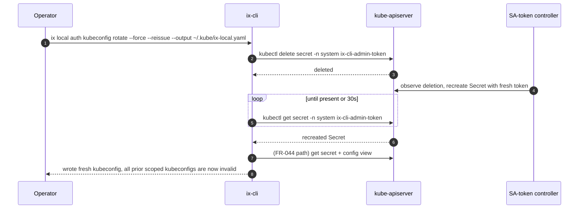

# [FR-045] `ix local auth kubeconfig rotate` — Invalidate and reissue SA token

> **Status:** skeleton. Ships after FR-044. This FR is registered now so
> callers (auth/FR-008 recovery matrix, operator runbooks) can reference
> the canonical revocation primitive.

## Description

`ix local auth kubeconfig rotate` invalidates the current
`Secret system/ix-cli-admin-token` by deleting it. The Kubernetes
ServiceAccount-token controller observes the deletion and re-creates the
Secret with a fresh long-lived token within one reconciliation cycle
(seconds, in practice). Because every previously-issued scoped kubeconfig
carries the now-deleted token value, rotation simultaneously invalidates
**all** outstanding operator-scoped kubeconfigs derived from FR-044.

This is the canonical revocation primitive for the operator-scoped
kubeconfig surface — there is no per-kubeconfig revocation path, since
every scoped kubeconfig shares the same SA token (auth/FR-008 Operator
Privilege Lifecycle, Recovery section).

Optionally, with `--reissue --output <path>`, the command immediately
re-runs the FR-044 emission path against the freshly-recreated Secret so
the operator does not have to invoke two commands.

## Synopsis

```
ix local auth kubeconfig rotate [--reissue --output <path>] [--force]
```

## Flags

| Flag | Required | Default | Description |
|---|---|---|---|
| `--reissue` | no | `false` | After rotation completes, emit a fresh scoped kubeconfig at `--output` using the FR-044 path. Requires `--output`. |
| `--output <path>` | conditional | — | Required when `--reissue` is set; same semantics as FR-044's `--output`. |
| `--force` | no | `false` | Skip the interactive confirmation prompt. Required in non-TTY contexts. |

## Behavior

1. **Confirm intent.** If stdin is a TTY and `--force` is not set, prompt
   `This will invalidate ALL outstanding ix-local scoped kubeconfigs. Proceed? [y/N]`.
   Declining the prompt SHALL exit 0 with no Kubernetes-side mutation.
2. **Delete the Secret.** `kubectl delete secret -n system ix-cli-admin-token`.
3. **Wait for recreation.** Poll `kubectl get secret -n system ix-cli-admin-token`
   with a 30-second deadline. The SA-token controller normally recreates
   the Secret within one reconciliation cycle; the deadline exists to
   surface controller-stuck or RBAC-misconfigured clusters loudly rather
   than silently leaving the cluster without a valid SA token.
4. **(Optional) Reissue.** If `--reissue` was supplied, invoke the
   FR-044 emission path with `--output` and (implicitly) `--force` so the
   freshly-rotated kubeconfig overwrites the stale file at the same path.

The decoded token value SHALL NOT appear in stdout, stderr, logs, or any
other output stream — same invariant as FR-044-CON-3.

## Errors

| Code | Trigger | Surface |
|---|---|---|
| `secret_not_found` | Secret is already missing before delete | "Already rotated or never provisioned. Run `ix local up` if the SA does not exist." |
| `secret_forbidden` | Caller cannot delete the Secret | "Caller cannot delete `system/ix-cli-admin-token`. Re-run from a kubeconfig with `delete` on that Secret." |
| `recreate_timeout` | Secret not recreated within 30s | "SA-token controller did not recreate the Secret within 30s. Check `kubectl describe sa -n system ix-cli-admin` and the controller-manager logs." |
| `reissue_failed` | `--reissue` was set and the FR-044 emission step failed | Propagates the FR-044 error envelope; the rotation itself has already succeeded at this point, so the caller MUST treat all outstanding scoped kubeconfigs as invalid even on this error. |

## Constraints

- **FR-045-CON-1**: The command SHALL require the same `kubectl get` on
  `system/ix-cli-admin-token` that FR-044 requires, plus `kubectl delete`
  on the same Secret. Both verbs are typically reachable only from a
  cluster-admin kubeconfig.
- **FR-045-CON-2**: The interactive confirmation prompt SHALL be present
  unless `--force` is set. In non-TTY contexts without `--force`, the
  command SHALL refuse to proceed (CI-safe failure). This is a spec-level
  mitigation for the irreversibility of token invalidation.
- **FR-045-CON-3**: A successful rotation followed by a failed `--reissue`
  SHALL surface as a non-zero exit, but the operator MUST be told
  explicitly that rotation succeeded and the prior scoped kubeconfigs are
  already invalid. The output SHALL NOT imply the operation can be safely
  retried as a no-op.
- **FR-045-CON-4**: The command SHALL NOT make any HTTP, HTTPS,
  WebSocket, or gRPC call to identity, auth-service, permission-service,
  or any other ix service. Only K8s API verbs against the Secret are
  permitted (matches FR-044-CON-1).
- **FR-045-CON-5**: The decoded SA token SHALL NOT appear in stdout,
  stderr, logs, telemetry, audit records, process argv, or environment
  variables (matches FR-044-CON-3).

## Acceptance Criteria

| ID | Criteria | Verification |
|---|---|---|
| FR-045-AC-1 | Running without `--force` on a TTY and declining the prompt SHALL exit 0 with no `kubectl delete` invocation | Unit test (mocked prompt + kubectl) |
| FR-045-AC-2 | Running with `--force` SHALL delete `Secret system/ix-cli-admin-token`; within 30s the Secret SHALL be recreated by the SA-token controller; the token value in the recreated Secret SHALL differ from the pre-rotation value | Integration test (kind cluster) |
| FR-045-AC-3 | With `--reissue --output <path> --force`, the command SHALL emit a fresh kubeconfig at `<path>` that authenticates as `system:serviceaccount:system:ix-cli-admin` after the rotation completes | Integration test |
| FR-045-AC-4 | A kubeconfig issued by FR-044 before this rotation SHALL fail authentication against the cluster after rotation completes (verified via `kubectl --kubeconfig=<old> get pods -n auth` returning a 401/`InvalidBearerToken`) | Integration test |
| FR-045-AC-5 | If the SA-token controller does not recreate the Secret within 30s, the command SHALL exit non-zero with the `recreate_timeout` envelope; the file at `--output` (if any) SHALL NOT be modified | Unit test (mocked kubectl never returning a recreated Secret) |
| FR-045-AC-6 | In a non-TTY context without `--force`, the command SHALL exit non-zero with a CI-safe message naming `--force` as the bypass; no `kubectl delete` SHALL be invoked | Unit test |
| FR-045-AC-7 | When `--reissue` is passed without `--output`, the command SHALL reject with exit code 2 and message `--reissue requires --output <path>`. No Secret deletion SHALL occur. | Unit test |

## Sequence



## Dependencies

- Upstream: identity/FR-034, FR-044 (issue path reused for `--reissue`),
  auth/FR-008 (Operator Privilege Lifecycle Recovery section names this
  command as the canonical revocation primitive).

## Out of scope

- Per-kubeconfig revocation (impossible with shared SA-token model).
- Bound-token rotation via projected SA tokens (tracked as a follow-up
  FR alongside the broader bound-token migration).
